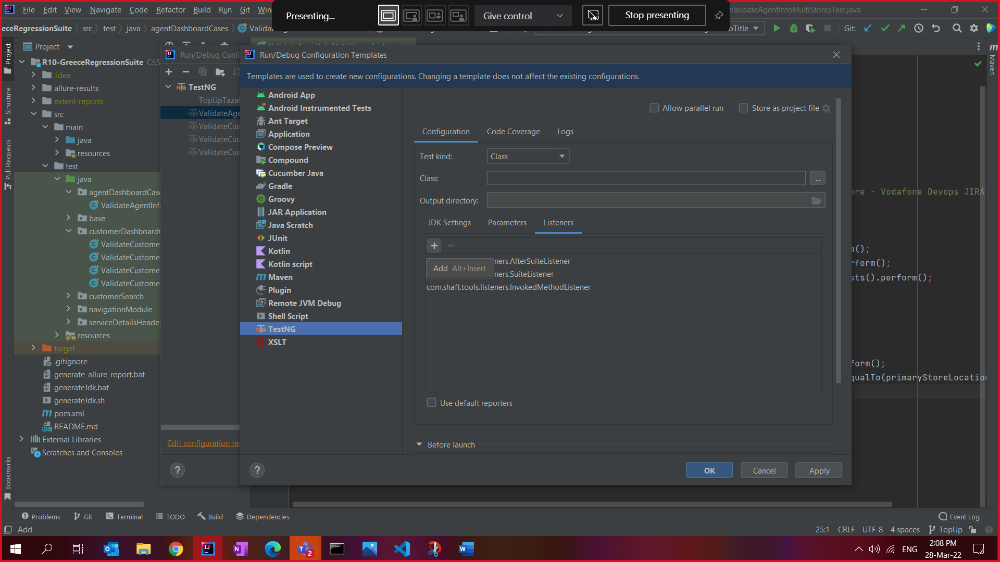
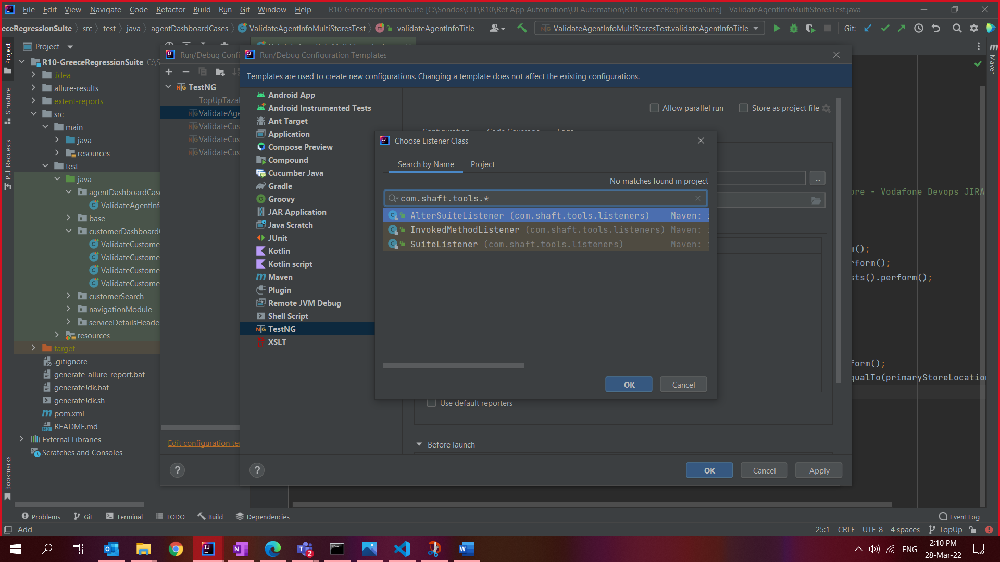
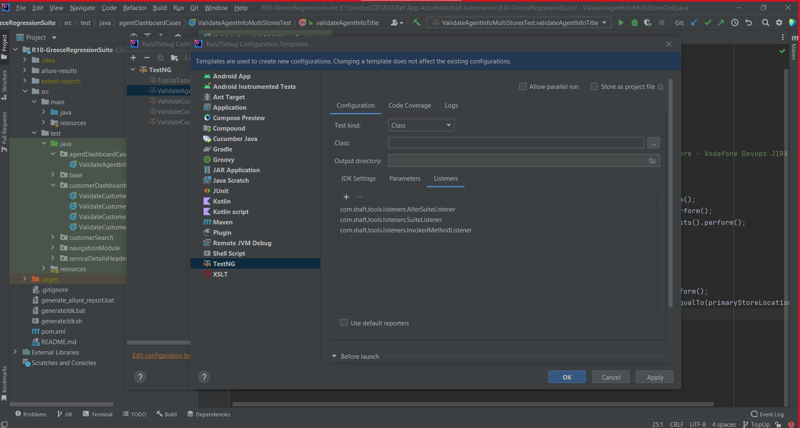

## IntelliJ

### Project Creation
Watch the following video

### Upgrading to SHAFT
Watch the following video

### Adding SHAFT listeners
##### Follow these steps:
1. Click on **Run** dorpdown menu and then select **Edit Configuration**

2. Click on **Edit Configuration** button

3. Click on **TestNG** button

4. Click on the **+** icon

5. In the search box we have to type __com.shaft.tools.\*__ then click on search icon. We have to add each of the following listeners by selecting each one of then and then click on **Ok** button

6. Click on **Apply** button and then on **Ok** button

## Eclipse
- SHAFT uses [TestNG] for test management, thus you will need to install TestNG plugin.
- TestNG plugin comes pre-installed with IntelliJ but needs to be installed if you are using Eclipse.

### TestNG Plugin Installation
- Step #1: Once Eclipse is launched, click on Help and then Eclipse Marketplace. 

- Step #2: A new window would open up, type “TestNG” in the Find text box and click on the Go button. 

- Step #3: You will now see the search results with TestNG for Eclipse at the top. All you need to do now is click on the Install button next to it. 

- Step #4: Resolving of features might take up a few minutes after which you need to verify that the checkbox for TestNG is checked and click on the Confirm button. 

- Step #5: Accept the license and click on the Finish button. 

- Notes:
  - Eclipse might show a warning regarding the installation of unsigned software, choose install anyway. 
  - For the change to be effective, Eclipse will prompt for a re-start, choose re-start now.

### Project Creation

[TestNG]:<https://testng.org/doc/>