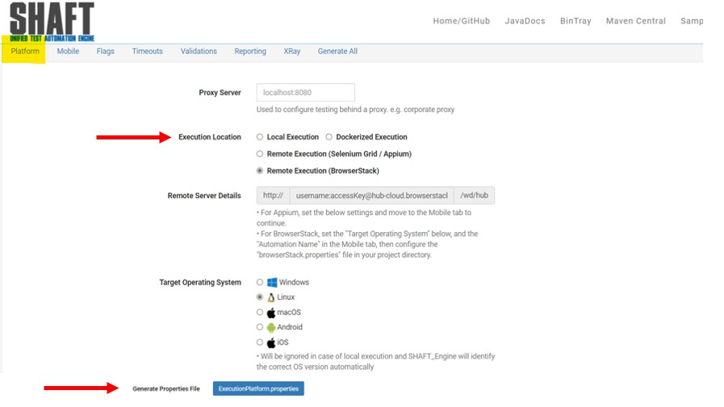
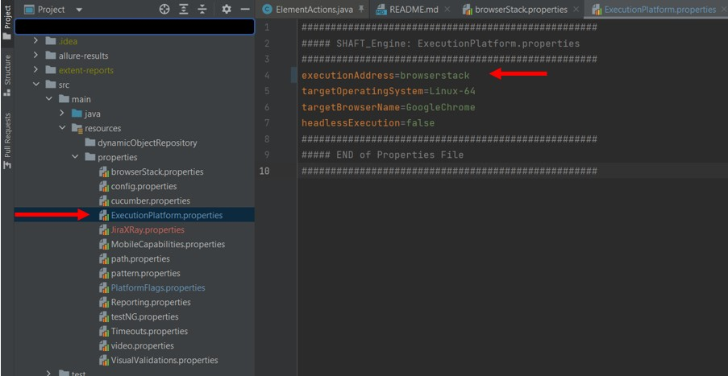
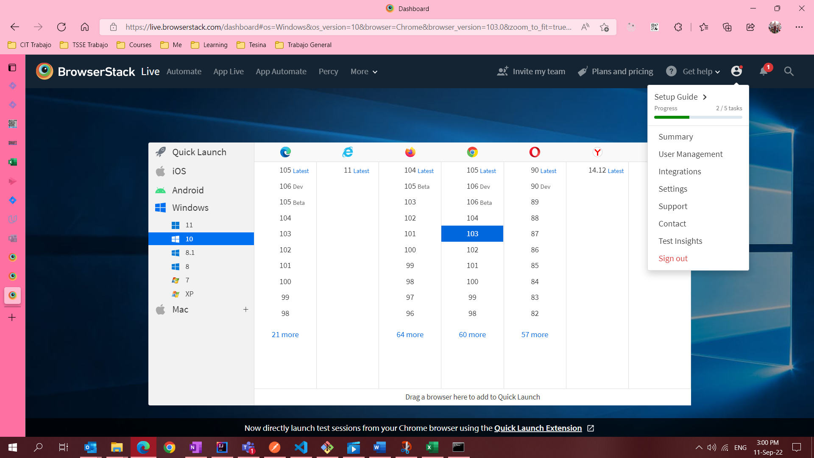
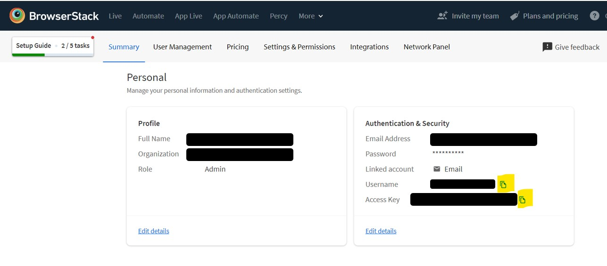
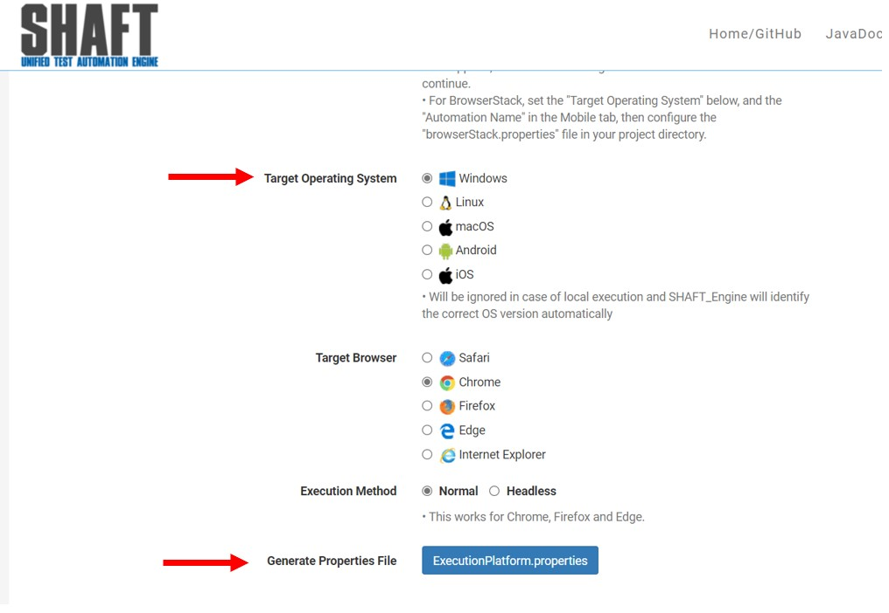
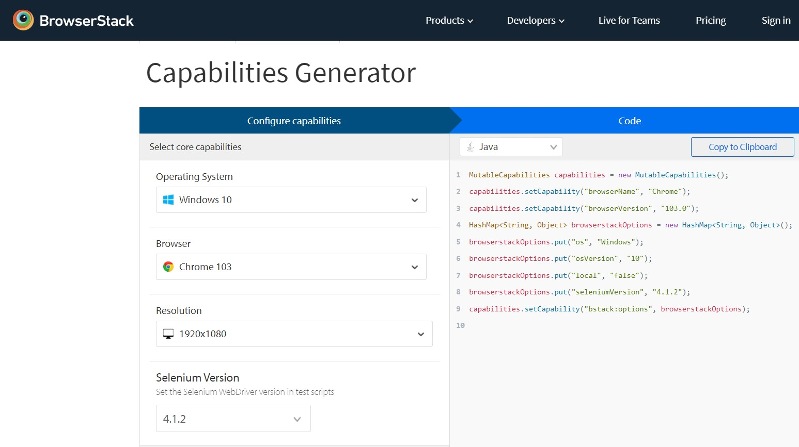
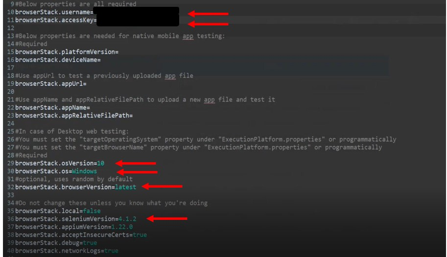
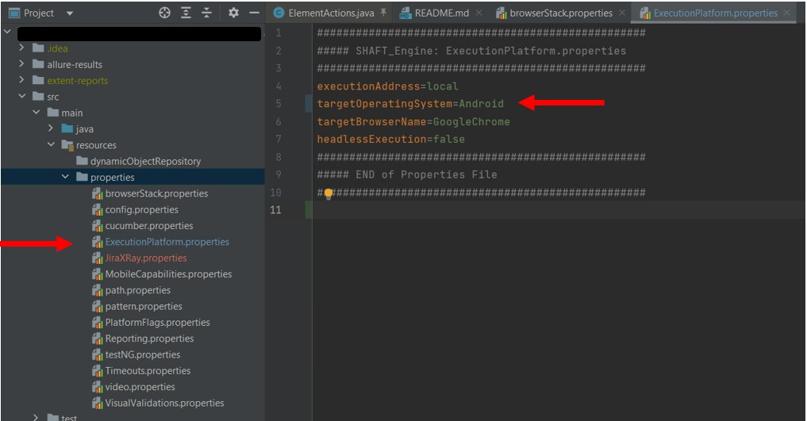
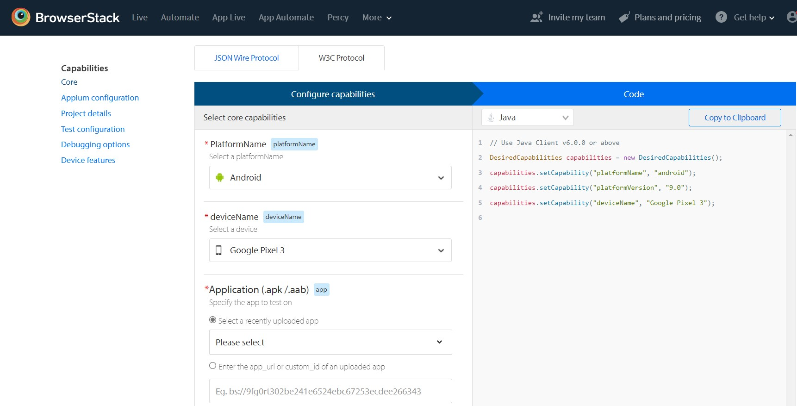
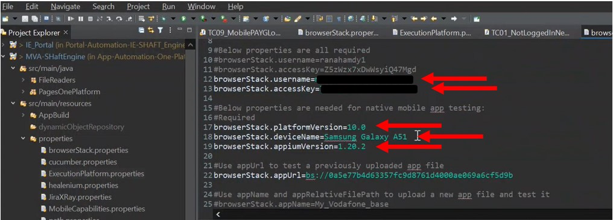

### Proxy:

### Execution Location:
We can execute our scripts in different locations, local, dockerized or remote execution. 

### 1. Local Execution:

### 2. Dockerized Execution:

### 3. Remote Execution (Selenium Grid / Appium):

### 4. Remote Execution (BrowserStack):

We can run any script using Shaft Engine via Browser stack only by setting some configurations that we can make from different locations: 

* #### Through configuration manager:

By openeing the **_Platform_** tab on [Configuration Manager](https://shafthq.github.io/SHAFT_ENGINE/ "Configuration Manager"), you can change the excution location as explained in the image below and then save the file and replace the corresponding configuration file in your project. Please note that once you select Remote Execution (BrowserStack) from Execution Location, the value of *_Remote Server Details_* will be filled automatically. 

* #### Through properties files:

For Web scripts, by openning the **_ExecutionPlatform.properties_** file you can change the value of **_executionAddress_** to be **_browserstack_**

##### Set the username and access key:

* Go to **_https://www.browserstack.com/users/sign_in_** and put the business e-mail and password then click **_Sign Me In_**

* Go to the **_Summary_** section 

* Copy the access key value:

##### Browserstack properties:

Browser stack itself provides its own configuration manager via the configuration file **_browserStack.properties_** in which we can find the proper configuration and proper URLs to execute scripts on web or on mobile platfrom. As explained in the below image.

### 4.1. To execute in web platform:

* #### Through configuration manager:

By openeing the **_Platform_** tab on [Configuration Manager](https://shafthq.github.io/SHAFT_ENGINE/ "Configuration Manager"), after selecting the **_Remote Execution (BrowserStack)_**, select the **_Target Operating System_** then save the file and replace the corresponding configuration file in your project. 

* #### Through properties files:

For Web scripts, by openning the **_ExecutionPlatform.properties_** file you can change the value of **_targetOperatingSystem_** to be **_windows-64_**, **_linux-64_**, etc. 

##### Set the capabilities on browser stack configuration manager:

* Go the Web URL: **_https://www.browserstack.com/automate/capabilities?tag=selenium-4_** to set the username and access key that we got from the previous steps and set the main capabilities from the **_Configure capabilities_** Section on the left select the target of the **_Opertaing System_**, the **_Browser_**, the **_Resolution_** and the **_Selenium Version_**. Once these fields are filled, the **_Code_** section will be filled automatically as explained in the below image. 

* Go back to **_browserStack.properties_** file to set the Operating system and its version, the browser version and the selenium version. Please pay attention to make the correct mapping as all these fields are case sensitive.

### 4.2. To execute in mobile platform:

* #### Through configuration manager:

By openeing the **_Platform_** tab on [Configuration Manager](https://shafthq.github.io/SHAFT_ENGINE/ "Configuration Manager"), after selecting the **_Remote Execution (BrowserStack)_**, select the **_Target Operating System_** then save the file and replace the corresponding configuration file in your project. 

* #### Through properties files:

For Web scripts, by openning the **_ExecutionPlatform.properties_** file you can change the value of **_targetOperatingSystem_** to be **_Android_** or **_iOS_**. 

##### Set the capabilities on browser stack configuration manager:

* Go the Web URL: **_https://www.browserstack.com/app-automate/capabilities?tag=w3c_** to set the username and access key that we got from the previous steps and set the main capabilities from the **_Configure capabilities_** Section on the left select the target of the **_Platform Name_**, the **_Device Name_** and the **_Application (.apk /.aab)_**. Once these fields are filled, the **_Code_** section will be filled automatically as explained in the below image. 

 Note that for the **_Application (.apk /.aab)_**, we have to pass our apk path to be make a post request to browserstack to upload the apk and recieve the response that will be on the console. We have to do that only for the first time in which we execute our suite or everytime we execute our suite on different versions.

* Go back to **_browserStack.properties_** file to set the Operating system and its version, the android/ios version , the device name and the appium version. Please pay attention to make the correct mapping as all these fields are case sensitive.

##### Execute the session live:

To see the live execution, whatever you are executing on web or mobile, just you need to go to **_https://automate.browserstack.com/dashboard/v2_** and then click on **_Automate_** and then we will find our execution results and all the related info. 

### Target Operating System:

### Maximum Performance Mode:

### AI Powered Self Healing:

